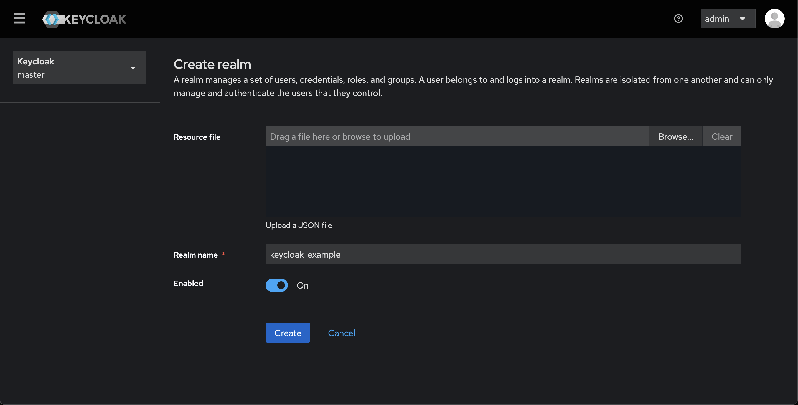
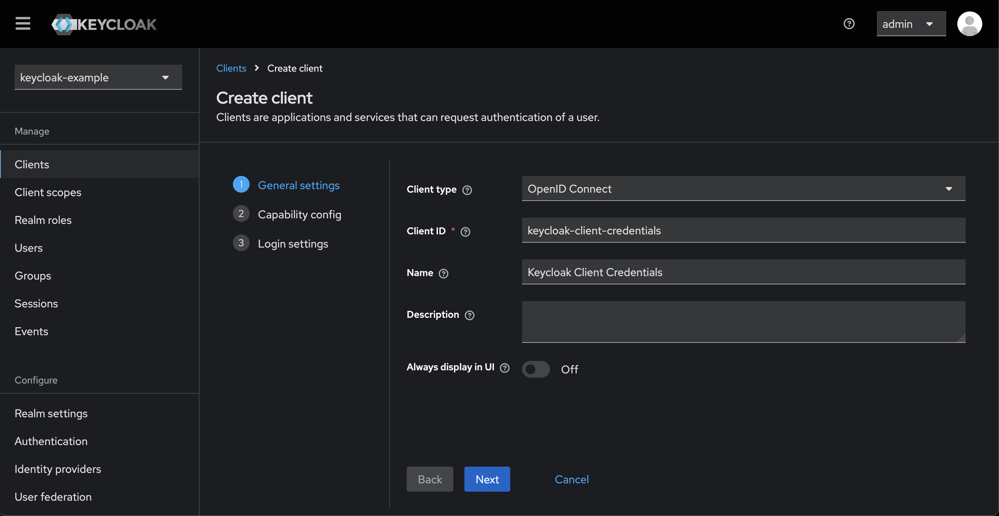
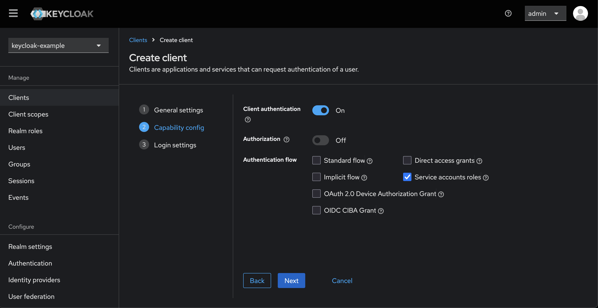
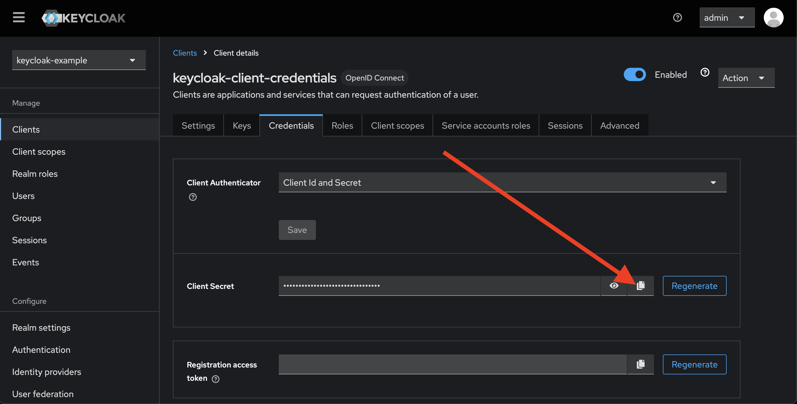

# Example of identity and access management from Keycloak

## Overview
This project demonstrates how to set up a **Keycloak authentication system** for an API, supporting both **Client Credentials Flow** (server-to-server communication) and **Authorization Code Flow** (user authentication). The project uses **Swagger UI** for API documentation and testing.

## Features
- ✅ **Keycloak integration** with a custom realm (`keycloak-example`)
- ✅ **Client Credentials Flow** for machine-to-machine authentication
- ✅ **Authorization Code Flow** for user authentication
- ✅ **OpenAPI 3.0 specification** for API documentation
- ✅ **Dockerized setup** using `docker-compose`
- ✅ **CORS configured** to allow API access via Swagger UI
- ✅ **Custom Scopes (`read`, `write`)** for fine-grained access control

## Prerequisites
- Docker & Docker Compose installed
- Keycloak 26.1.2 (or later)
- A Keycloak admin account

## Development

### Start the project with Docker Compose
Run the following command to start Keycloak and Swagger UI:

```sh
docker-compose up -d
```

This will start:
- **Keycloak** on `http://localhost:9090`
- **Swagger UI** on `http://localhost:8080`

## Setup Instructions

### Keycloak Configuration
After starting Keycloak, follow these steps:

#### Step 1: Create a new Realm
1. Open Keycloak Admin UI: `http://localhost:9090/admin`
2. Login with default admin credentials:
    - **Username:** `admin`
    - **Password:** `admin`
3. Click **Create Realm** → Name: `keycloak-example` → Save.
   

#### Step 2: Create Clients

##### Client 1: Machine-to-Machine Authentication (Client Credentials Flow)
1. Go to **Clients** → Click **Create client**
2. **Client Type:** `OpenID Connect`
3. **Client ID:** `keycloak-client-credentials`
   
4. Enable **Client Authentication**
5. Disable **Standard Flow** (not needed for Client Credentials Flow)
   
6. Click **Save**
7. Go to the **Credentials** tab → Copy `client_secret`
   

##### Client 2: User Authentication (Authorization Code Flow)
1. Go to **Clients** → Click **Create client**
2. **Client ID:** `keycloak-authorization-code`
3. **Client Type:** `OpenID Connect`
4. Enable **Standard Flow** (needed for Authorization Code Flow)
5. **Valid Redirect URIs:** `http://localhost:8080/*`
6. Click **Save**

#### **Step 3: Configure CORS**
For both clients, set:
- **Web Origins:** `http://localhost:8080`
- **Valid Redirect URIs:** `http://localhost:8080/*`

#### **Step 4: Define Scopes (`read`, `write`)**
1. Go to **Realm Settings** → **Client Scopes**
2. Click **Create Client Scope** → Name: `read` → Type: Default → Save
3. Click **Create Client Scope** → Name: `write` → Type: Default → Save
4. Go to **Clients** → `keycloak-client-credentials` → **Client Scopes**
5. Assign **`read` and `write`** as **Default Client Scopes**

#### **Step 5: Create a Test User**
1. Go to **Users** → Click **Add User**
2. **Username:** `testuser`
3. **Email:** `test@example.com`
4. **First Name:** `Test`, **Last Name:** `User`
5. Click **Save**
6. Go to the **Credentials** tab → Set **Password:** `testpassword` → Disable Temporary ✅

## Authentication Flows

### Client Credentials Flow (Machine-to-Machine Authentication)
Request an **Access Token** for `keycloak-client-credentials`:

```sh
curl -X POST "http://localhost:9090/realms/keycloak-example/protocol/openid-connect/token" \
  -H "Content-Type: application/x-www-form-urlencoded" \
  -d "client_id=keycloak-client-credentials" \
  -d "client_secret=MY_SECRET" \
  -d "grant_type=client_credentials"
```

Expected response:
```json
{
  "access_token": "eyJhbGciOiJSUzI1NiIsInR5cCIg...",
  "expires_in": 300,
  "scope": "read write profile email"
}
```

Use the token for API requests:
```sh
curl -X GET "http://localhost:8080/api/v1/user" \
  -H "Authorization: Bearer YOUR_ACCESS_TOKEN"
```

### Authorization Code Flow (User Login)

Request user login:
```sh
http://localhost:9090/realms/keycloak-example/protocol/openid-connect/auth?
response_type=code&
client_id=keycloak-authorization-code&
redirect_uri=http://localhost:8080/oauth2-redirect.html&
scope=openid%20read%20write&
state=/original-path
```

After logging in, Keycloak redirects with `code` parameter. Exchange it for an Access Token:
```sh
curl -X POST "http://localhost:9090/realms/keycloak-example/protocol/openid-connect/token" \
  -H "Content-Type: application/x-www-form-urlencoded" \
  -d "client_id=keycloak-authorization-code" \
  -d "grant_type=authorization_code" \
  -d "code=AUTH_CODE" \
  -d "redirect_uri=http://localhost:8080/oauth2-redirect.html"
```

## Notes
- `client_secret` **is required for `keycloak-client-credentials`, but NOT for `keycloak-authorization-code`**.
- If using **Swagger UI**, leave `client_secret` **empty** for user authentication.
- The **Redirect URL dynamically returns users to the page they started from** using `state`.
